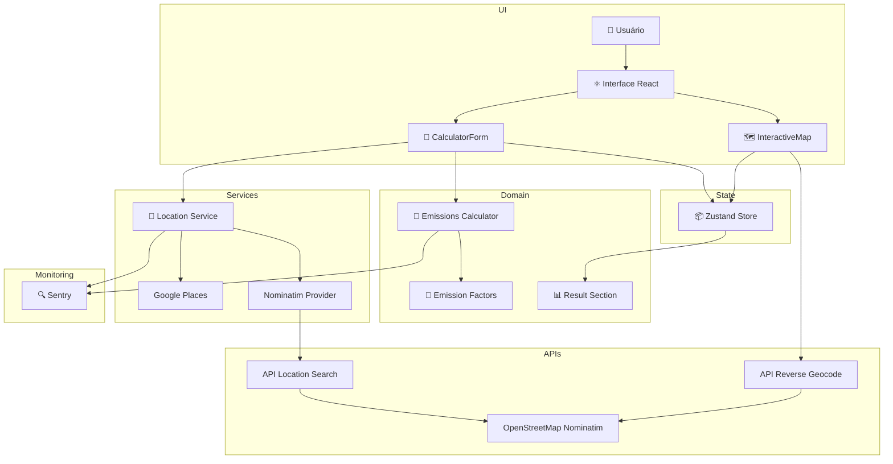

# 🌱 EcoTrip Calculator

**Simulador de Impacto Ambiental para Viagens**

    

---

## 📋 Índice

- [🚀 Visão Geral](#-visão-geral)
- [✨ Funcionalidades](#-funcionalidades)
- [🛠️ Tecnologias Utilizadas](#-tecnologias-utilizadas)
- [🏗️ Arquitetura](#️-arquitetura)
- [🎯 Principais Decisões Técnicas](#-principais-decisoes-t%C3%A9cnicas)
- [📦 Estrutura do Projeto](#-estrutura-do-projeto)
- [⚙️ Instalação](#-instalação)
- [🔑 Variáveis de Ambiente](#-variáveis-de-ambiente)
- [🧪 Testes](#-testes)
- [📈 Qualidade e Boas Práticas](#-qualidade-e-boas-pr%C3%A1ticas)
- [📸 Screenshots](#-screenshots)
- [🚀 Possíveis Evoluções](#-possíveis-evoluções)
- [👩‍💻 Sobre a Desenvolvedora](#-sobre-a-desenvolvedora)
- [📫 Contato](#-contato)

---

## 🚀 Visão Geral

EcoTrip Calculator é uma aplicação Web construída em **Next.js 16** que transforma viagens em métricas de impacto ambiental.

O projeto permite que usuários calculem emissões de CO₂ por percurso, comparem diferentes meios de transporte e visualizem dados ambientais por pessoa.

### Objetivos do projeto

- Calcular emissões de CO₂ de viagens usando origem e destino.
- Oferecer comparação de transporte com base em fatores de emissão.
- Proporcionar seleção de rotas por autocomplete e mapa interativo.
- Permitir análise tanto no modo simples quanto no modo personalizado.

### Proposta de valor

EcoTrip Calculator ajuda a conscientizar sobre o impacto de escolhas de mobilidade, entregando uma ferramenta prática para avaliar rotas, transporte e compensação ambiental.

---

## ✨ Funcionalidades

### Cálculo e comparação

- Cálculo de emissões em modo **simples** e **personalizado**.
- Seleção de transporte principal entre carro, motocicleta, ônibus, trem, avião, caminhão, navio, bicicleta e caminhada.
- Comparativo de emissões entre transportes escolhidos.
- Distância calculada via **Haversine**.

### Localização e mapa

- Autocomplete de endereço com busca por país (`BR`).
- Mapa interativo com marcador arrastável.
- Reverse geocoding via API interna `/api/geocode-reverse`.
- Fallback de localização com `Nominatim` quando o Google Places não está disponível.

### Experiência do usuário

- Tema claro/escuro com persistência local.
- Feedback de validação em formulário.
- Interface responsiva e otimizada para desktop e mobile.
- Resultados apresentados com gráficos, badges e explicações de impacto.

### Observabilidade

- Captura de erros e eventos com **Sentry**.
- Tracking de desempenho e serviços externos.
- Logs estruturados para falhas em autocomplete e geocoding.

---

## 🛠️ Tecnologias Utilizadas

| Categoria       | Ferramentas                                             |
| --------------- | ------------------------------------------------------- |
| Frontend        | `Next.js 16`, `React 19`, `TypeScript`                  |
| Estado global   | `Zustand`                                               |
| Formulários     | `react-hook-form`, `zod`                                |
| Mapas           | `react-leaflet`, `leaflet`, `@googlemaps/js-api-loader` |
| APIs            | `Next.js API Routes`, `OpenStreetMap Nominatim`         |
| Observabilidade | `@sentry/nextjs`                                        |
| Testes          | `Jest`, `@testing-library/react`, `Cypress`             |
| Qualidade       | `ESLint`, `Prettier`, `commitlint`, `Husky`             |
| Deploy          | `Vercel`                                                |

---

## 🏗️ Arquitetura

A aplicação segue um padrão modular e escalável, separando a interface do estado e da lógica de negócio.

- `src/app` — layout global, SEO e página principal.
- `src/components` — divisão entre `atoms`, `molecules` e `organisms`.
- `src/hooks` — hooks customizados para mapa e autocomplete.
- `src/stores` — estado global com `Zustand`.
- `src/services` — regras de cálculo e integração com provedores de localização.
- `src/lib` — constantes, textos, erros e observabilidade.
- `src/providers` — configuração de `react-query` e contexto de tema.

### Fluxo de dados

1. Usuário interage com o formulário e o mapa.
2. Autocomplete consulta `LocationService`.
3. `LocationService` tenta `GooglePlacesProvider` e recorre ao `NominatimProvider` em fallback.
4. O estado é atualizado em `useTripStore`.
5. `calculateTripEmissions` calcula resultados e compara transportes.
6. Resultados são exibidos em `ResultSection` com gráfico e métricas.

### Diagrama Mermaid



---

## 🎯 Principais Decisões Técnicas

- **Zustand** foi escolhido para manter estado global leve e fácil de estender.
- **Next.js App Router** permite layout compartilhado, metadata e carregamento de componentes cliente.
- **react-hook-form + zod** garante validação tipada e mensagens de erros claras.
- **Import dinâmico do Leaflet** evita SSR e melhora tempo de carregamento inicial.
- **Fallback de localização** oferece resiliência entre Google Places e Nominatim.
- **QueryProvider** com `react-query` prepara a aplicação para consumo eficiente de dados.
- **Tema persistente** via `ThemeContext`, para experiência consistente em todos os acessos.
- **Observabilidade com Sentry** e eventos customizados para monitorar erros, performance e serviços externos.

---

## 📦 Estrutura do Projeto

```text
src/
├─ app/
│  ├─ api/
│  │  ├─ geocode-reverse/route.ts
│  │  └─ location-search/route.ts
│  ├─ globals.css
│  ├─ layout.tsx
│  └─ page.tsx
├─ components/
│  ├─ atoms/
│  ├─ molecules/
│  └─ organisms/
├─ contexts/
│  └─ ThemeContext.tsx
├─ hooks/
│  ├─ useMapIcon.ts
│  ├─ useMapPosition.ts
│  └─ usePlaceAutocomplete.ts
├─ lib/
│  ├─ constants/
│  ├─ errors/
│  └─ observability/
├─ providers/
│  ├─ query.ts
│  └─ QueryProvider.tsx
├─ schemas/
│  └─ calculator.ts
├─ services/
│  ├─ LocationService.ts
│  ├─ calculatorService.ts
│  └─ locations/
│     ├─ GooglePlaceProvider.ts
│     ├─ NominatimProvider.ts
│     └─ types.ts
└─ stores/
 └─ useTripStore.ts
```

---

## ⚙️ Instalação

### Requisitos

- Node.js 20+
- npm 10+

### Passos

```bash
git clone `https://github.com/iolymmoliveira/ecoTrip`
cd eco-trip-dio
npm install
```

### Executar localmente

```bash
npm run dev
```

Acesse: `http://localhost:3000`

### Build de produção

```bash
npm run build
npm start
```

---

## 🔑 Variáveis de Ambiente

| Variável                              | Descrição                                         |
| ------------------------------------- | ------------------------------------------------- |
| `NEXT_PUBLIC_GOOGLE_MAPS_API_KEY`     | Chave pública para autocomplete de endereços      |
| `SENTRY_DSN`                          | DSN do Sentry para captura de erros e performance |
| `NEXT_PUBLIC_SENTRY_DSN`              | DSN público opcional para browser                 |
| `SENTRY_RELEASE`                      | Identificador de release para Sentry              |
| `NEXT_PUBLIC_SENTRY_RELEASE`          | Identificador de release exposto no browser       |
| `SENTRY_TRACES_SAMPLE_RATE`           | Taxa de tracing do Sentry                         |
| `SENTRY_REPLAYS_SESSION_SAMPLE_RATE`  | Taxa de replay de sessão                          |
| `SENTRY_REPLAYS_ON_ERROR_SAMPLE_RATE` | Taxa de replay em erro                            |

> O arquivo `.env` contém placeholders que já foram criados no projeto.

---

## 🧪 Testes

### Ferramentas utilizadas

- `Jest` com `@testing-library/react`
- `Cypress` para testes End-to-End

### Como executar

```bash
npm test
npm run test:watch
npm run cypress:open
npm run cypress:run
```

### Cobertura de testes

- Testes de unidade para `calculateHaversineDistance` e `calculateTripEmissions`.
- Testes de componentes para `Header`, `Footer`, `TransportSelector`, `LocationAutocomplete`, `ThemeContext`, `QueryProvider` e `useTripStore`.

---

## 📈 Qualidade e Boas Práticas

- **TypeScript estrito** com tipagem forte em todo o projeto.
- **Componentização** clara entre unidades reutilizáveis e layouts.
- **Validação** com `zod` para entradas de formulário e dados de localização.
- **Performance** com debounce em autocomplete e cache de queries.
- **Responsividade** e experiência mobile-first.
- **Acessibilidade** com `role`, `aria-*`, labels e foco lógico.
- **Tratamento de erros** com logger centralizado e fallback de APIs.
- **Observabilidade** com eventos de negócio, monitoramento de serviços externos e tracing.

---

## 📸 Screenshots

> TODO: Substituir estas referências por imagens reais do projeto.

- `./screenshots/homepage.png`
- `./screenshots/calculator.png`
- `./screenshots/result-section.png`

---

## 🚀 Possíveis Evoluções

- Integração de rota real via API de Directions para maior precisão de distância.
- Histórico de viagens para usuários autenticados.
- Exportação de relatórios em PDF ou CSV.
- Dashboard analítico com métricas de emissões acumuladas.
- Implementação de compensação de carbono com créditos ambientais.

---

## 👩‍💻 Sobre a Desenvolvedora

Este projeto demonstra uma abordagem profissional de frontend e arquitetura web.

- Experiência com **React**, **Next.js** e **TypeScript**.
- Forte foco em **arquitetura de software**, separação de concerns e design de componentes.
- Prática em **integrações com APIs externas** e fallback resiliente.
- Compromisso com **qualidade de código**, testes e observabilidade.
- Capacidade de desenvolver aplicações escaláveis e com excelente experiência de usuário.

---

## 📫 Contato

[](https://www.linkedin.com/in/iolymmoliveira/) [](https://github.com/iolymmoliveira) [](mailto:iolymmoliveira@gmail.com)
